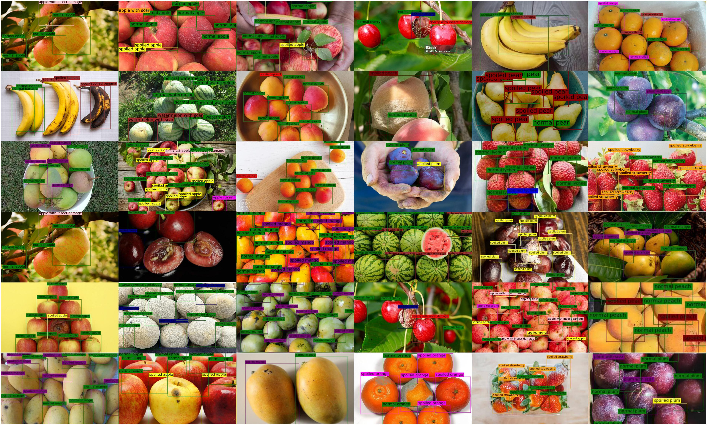

# Supplementary material for "FDD-48: Towards Real-World Food Defect Detection with Fine-grained Annotations across Diverse Scenarios"

This repository contains the supplementary material for the paper "FDD-48: Towards Real-World Food Defect Detection with Fine-grained Annotations across Diverse Scenarios", under review in Proceedings of ACM Multimedia 2025 (MM'25) Dataset Track.

## FDD-48 Dataset

### Download Dataset
[Dataset can be download here.]()

### Food Defect Categories

### More Dataset Examples

## FDDet

### Implementation Details

To ensure training stability while reducing training time overhead, FDDet employs a two-stage training scheme: first conducting fully supervised training until model convergence, then initiating semi-supervised training from the best-performing checkpoint.
For BBoxMixUp, the default Beta distribution parameters are $\alpha=1$ and $\beta=0.5$. In the semi-supervised learning framework, the default threshold for initial pseudo-label filtering is 0.35. For CGPC, RegNet is used as the default pre-trained visual backbone. Both training stages use a batch size of 32. The first training stage runs for 300 epochs. The second stage runs for 1000 iterations, with each batch comprising a 1:1 ratio of labeled to unlabeled data. We use the AdamW optimizer with a learning rate of 0.004.

### Ablation Study

#### Component Analysis

We conduct an ablation study on the FDD-48 dataset to evaluate the contribution of each proposed component: BBoxMixUp (BM), semi-supervised learning (SSL), and Consistency-Guided Pseudo-Label Calibration (CGPC).

| **BM** | **SSL** | **CGPC** | **mAP50:95 (%)** | **mAP50 (%)** | **mAP75 (%)** |
|:---:|:---:|:---:|:---:|:---:|:---:|
|  |  |  | 40.0 | 45.6 | 43.7 |
| ✓ |  |  | 41.4 | 47.9 | 44.7 |
| ✓ | ✓ |  | 41.7 | 48.3 | 45.2 |
| ✓ | ✓ | ✓ | **42.2** | **49.0** | **46.0** |

#### Beta Distribution Parameters ($\alpha$, $\beta$) in BBoxMixUp

We conducted an ablation study to determine the optimal hyperparameters $\alpha$ and $\beta$ for the Beta distribution used in BBoxMixUp, which dictates the mixing ratio $\lambda$. The model configuration used was baseline+BBoxMixUp, and results were reported on the FDD-48 dataset.

We explored four distinct pairs of $(\alpha, \beta)$ values, each representing a different characteristic for the distribution of $\lambda$: $(\alpha=0.5, \beta=0.5)$ which generates a U-shaped distribution, favoring $\lambda$ values close to 0 or 1; $(\alpha=1, \beta=1)$ which results in a uniform distribution, where any $\lambda$ between 0 and 1 is equally probable; $(\alpha=0.5, \beta=1)$ which produces a distribution skewed towards 0, meaning the candidate region $I_{i'}(b_{i'j'})$ often contributes more to the mix; and $(\alpha=1, \beta=0.5)$ which produces a distribution skewed towards 1, meaning the target region $I_i(b_{ij})$ often contributes more to the mix.

| **α** | **β** | **mAP50:95(%)** | **mAP50(%)** | **mAP75(%)** |
|:---:|:---:|:---:|:---:|:---:|
| 0.5 | 0.5 | 38.3 | 45.7 | 42.0 |
| 1.0 | 1.0 | 37.0 | 43.1 | 40.1 |
| 0.5 | 1.0 | 37.5 | 44.5 | 41.0 |
| 1.0 | 0.5 | **41.4** | **47.9** | **44.7** |

#### Threshold for Initial Selection of Pseudo-Labels

We investigated the impact of the initial pseudo-label filtering threshold. A lower threshold generally provides more candidate pseudo-labels for our CGPC to utilize.

| **thr.** | **mAP50:95(%)** | **mAP50(%)** | **mAP75(%)** |
|:--------:|:--------------------------:|:--------------------:|:--------------------:|
| 0.30     | 42.1                       | 48.7                 | 45.8                 |
| 0.35     | **42.2**                   | **49.0**             | **46.0**             |
| 0.40     | 41.8                       | 48.3                 | 45.0                 |
| 0.45     | 42.0                       | 48.4                 | 45.2                 |
| 0.50     | 41.6                       | 48.0                 | 44.8                 |

#### Threshold of feature similarity in CGPC

We conducted an ablation study to determine the optimal feature similarity threshold for identifying peer pseudo-labels within the Visual-Semantic Consistency component of CGPC.

| **thr.** | **mAP50:95(%)** | **mAP50(%)** | **mAP75(%)** |
|:---:|:---:|:---:|:---:|
| 0.75 | 42.0 | 48.5 | 45.3 |
| 0.80 | **42.2** | **49.0** | **46.0** |
| 0.85 | 42.0 | 48.5 | 45.2 |
| 0.90 | 41.5 | 48.0 | 44.8 |

#### Pre-trained visual backbone used to extract feature similarity in CGPC

To select an effective pre-trained visual backbone for extracting region features in the Visual-Semantic Consistency component of CGPC, we experimented with ResNet-152, DINOv2-ViT-L-14, and RegNet-Y-32GF.

| **Model** | **mAP50:95(%)** | **mAP50(%)** | **mAP75(%)** |
|:-----------------:|:------:|:------:|:------:|
| ResNet-152        | **42.2** |  48.8  |  45.9  |
| DINOv2-ViT-L-14   |  42.1  |  48.7  |  45.6  |
| RegNet-Y-32GF     | **42.2** | **49.0** | **46.0** |