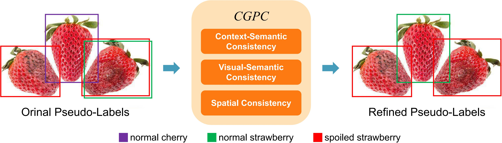

# FDD-48: Towards Real-World Food Defect Detection with Fine-grained Annotations across Diverse Scenarios

This repository contains the official dataset and code for the paper "FDD-48: Towards Real-World Food Defect Detection with Fine-grained Annotations across Diverse Scenarios", under review in Proceedings of ACM Multimedia 2025 (MM'25) Dataset Track.

**Authors:** Ruihao Xu, Yong Liu, Yansong Tang* (* Corresponding author)
**Affiliation:** Tsinghua Shenzhen International Graduate School, Tsinghua University, Shenzhen, Guangdong, China

## Abstract

Food defect detection is a critical task in quality control for the food industry. Recent research primarily employs deep learning methods to improve detection accuracy, yet existing studies lack a unified evaluation benchmark and are constrained by data scarcity due to high annotation costs. To address these challenges, we first introduce FDD-48, a comprehensive food defect detection dataset with fine-grained annotations across 13 food types and 48 distinct defect categories, captured under diverse real-world conditions. Subsequently, we evaluate the performance of several mainstream general object detection models on FDD-48. To enhance detection performance under limited annotated data, we propose a semi-supervised food defect detection framework named FDDet. FDDet first introduces a novel data augmentation technique specifically designed for food defect detection, named BBoxMixUp, which breaks the erroneous associations between defect-irrelevant features and defect types by mixing regions corresponding to instances of the same defect category in input images. Additionally, FDDet incorporates a pseudo-label filtering mechanism called CGPC (Consistency-Guided Pseudo-Label Calibration), a strategy based on the assumption of label consistency among similar regions within individual samples. Experiments demonstrate that, compared to mainstream object detection models, our method significantly improves detection performance on the FDD-48 dataset, validating the effectiveness of the proposed approach in enhancing the accuracy and robustness of complex food defect detection tasks under limited data conditions.

## FDD-48 Dataset

FDD-48 is a novel benchmark dataset for food defect detection designed to address the limitations of existing datasets by providing diverse real-world scenarios, fine-grained defect categories, and instance-level annotations.

### Dataset Overview
* Covers diverse real-world scenarios including Planting, Transportation, and Consumption.
* Consists of 13 food categories, 48 food defect categories.
* Includes 4000 images, of which 1503 images are labeled, and 2497 images are unlabeled. The labeled data is randomly split into training and testing sets in a 7:3 ratio.
* In labeled images, there are 15,913 instance-level annotations with defected food types and bounding boxes. Approximately 10.58 objects per image.

### Food Defect Categories

### Data Acquisition and Annotation Workflow

The data acquisition and annotation pipeline involved several steps:
1.  **Web Crawling:** Initial collection of 50,000 raw images using "food category + defect type" as keywords.
2.  **MLLM Discrimination (Noisy Data Filtering):** A multimodal large model (MiniCPM-V-2.6) was used to automatically assess and remove images not containing the target food type.
3.  **Duplicate Removal:** DINOv2 was used to extract image features, and images with high similarity were removed.
5.  **OVD Pre-annotation:** YOLO-World, an open-source object detector, was used with textual prompts (13 fruit names) to generate initial bounding box annotations for normal and defective fruits. The confidence threshold was lowered to improve detection of defective fruits.
7.  **Manual Annotation:** Manual verification was conducted to annotate missed fruit instances and assign specific defect labels to all bounding boxes, ensuring high-quality annotations.

### More Dataset Examples

## FDDet Method

FDDet is a food defect detection model tailored for real-world scenarios, particularly under limited annotated data conditions. It employs RTMDet as its baseline.

### Key Components

#### BBoxMixUp

* A novel data augmentation technique specifically designed for food defect detection.
* It performs localized mixing exclusively within bounding boxes of the same defect category.
* **Goal:** To break erroneous associations between defect-irrelevant features (e.g., shape, color of the fruit) and defect types, enhance diversity in non-defect features, and mitigate overfitting due to data scarcity.

#### Semi-Supervised Learning (SSL) Adaptation
* Leverages the 2,497 unlabeled samples in FDD-48 to improve model robustness.
* Addresses training collapse issues encountered with common semi-supervised object detection frameworks on FDD-48.
* **Modifications to stabilize training and improve performance:**
    * **Buffer Weight Updates:** The teacher model's buffer weights (e.g., Batch Normalization parameters) are updated via Exponential Moving Average (EMA). This allows the teacher model to adapt to domain shifts between labeled and unlabeled data.
    * **Pseudo-label Filtering Threshold:** A lower fixed threshold (e.g., 0.35) is used for pseudo-label filtering instead of conventional high-confidence thresholds (e.g., 0.9). This retains more potentially valuable pseudo-labels, especially given the high similarity between certain food defect types and inherently lower model confidence scores on FDD-48.

#### Consistency-Guided Pseudo-Label Calibration (CGPC)

* A novel pseudo-label filtering and refinement strategy to improve the quality of pseudo-labels generated by the teacher model in the SSL framework.
* **Core Idea:** Enforces multi-dimensional consistency constraints to calibrate initial pseudo-labels.
* **Context-Semantic Consistency:** Assumes food instances within the same image typically belong to the same high-level food category. All pseudo-labels in a single image are unified to the most frequent food type identified among them.
* **Visual-Semantic Consistency:** Ensures visually similar regions receive consistent labels. Region features are extracted using an external pretrained backbone (e.g., RegNet). For each pseudo-label, its "peers" (regions with feature similarity exceeding a threshold) are identified, and the label is replaced with the most frequent label among these peers. Using an external backbone helps mitigate the detection model's overfitting and biases.
* **Spatial Consistency:** Removes spatially redundant pseudo-labels. An IOU-based method similar to Non-Maximum Suppression (NMS) is applied after context-semantic and visual-semantic corrections to eliminate duplicate detections for the same object instance.

## Citation

If you use FDD-48 or FDDet in your research, please cite our paper: (bibtex coming soon)